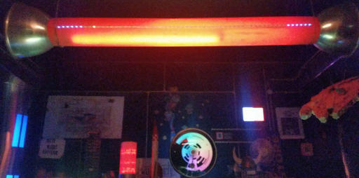

# 1d-led-stripe

A collection of games and animations based on a single LED stripe.

Requirements:

  * Add additional board manager url: **http://arduino.esp8266.com/stable/package_esp8266com_index.json**
  * In board manager install **esp8266 by ESP8266 Community**
  * Install the following libraries:
    * ArduinoOTA
    * Adafruit Neopixel
    * PubSubClient

