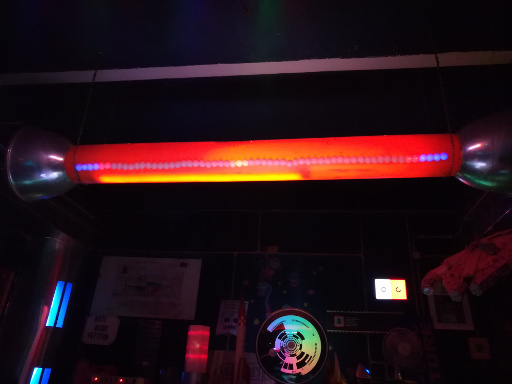
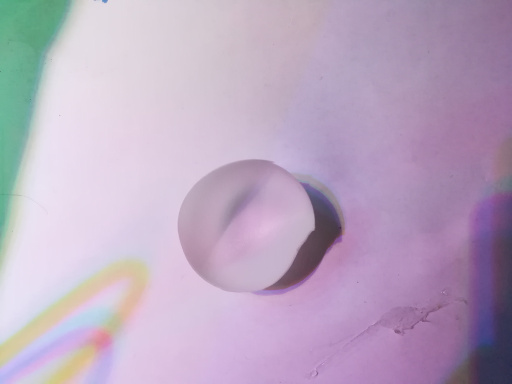

# 1d-led-stripe

A collection of games and animations based on a single LED stripe.

Requirements:

  * Add additional board manager url: **http://arduino.esp8266.com/stable/package_esp8266com_index.json**
  * In board manager install **esp8266 by ESP8266 Community**
  * Install the following libraries:
    * ArduinoOTA
    * Adafruit Neopixel
    * PubSubClient

--------------
Add Ping-Pong Balls for even nicer experience:

You need Ping Pong Balls (one for two LEDs):

Cut in Half:

Stick some of them together in a stack with the help of hot glue:

attach the stacks one after another to the LED strip and you are done!
You should increase the brightness a littebit.
This is the final result:

